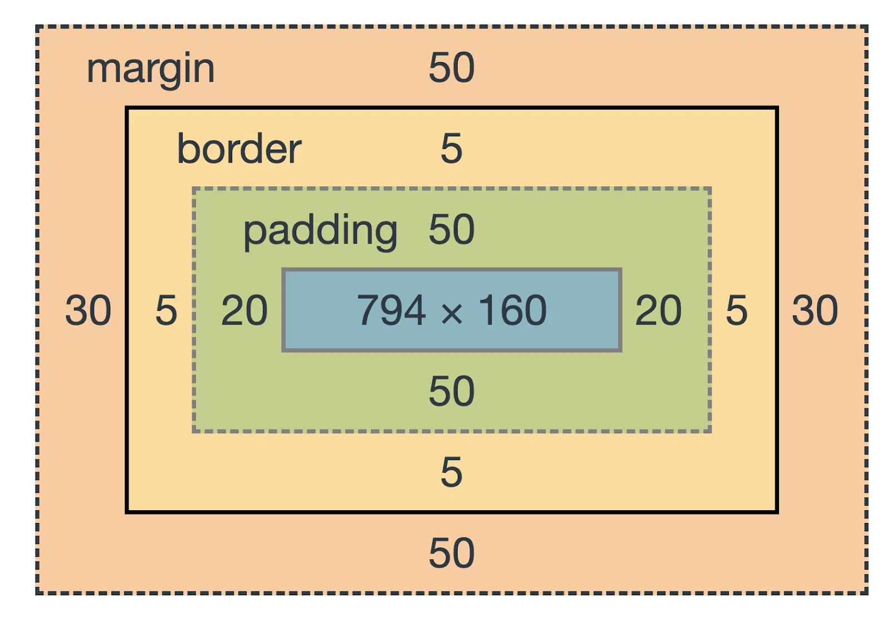

# CSS Box Model

## Introduction

The CSS Box Model describes how an HTML element is structured and sized.
Every element consider as a rectangular box.

It has four parts:

1. Content
2. Padding
3. Border
4. Margin



## Content

Content is the actual text, image, or other information inside the element.

```css
.box {
    width: 200px;
    height: 100px;
}
```

## Padding

Padding is the space between the content and border.

```css
.box {
    padding: 20px;
}
```

## Border

Border is the line around the content and padding.

```css
.box {
    border: 2px solid black;
}
```

## Margin

Margin is the space outside the border. It creates space between elements.

```css
.box {
    margin: 20px;
}
```

## Box-sizing

The box-sizing property defines how the width and height of an element are calculated.

There are two main values:

### 1. content-box

This is the default value.

```css
.box {
    width: 200px;
    padding: 20px;
    border: 5px solid black;
    box-sizing: content-box;
}
```

Here, 200px is only the content width.

```text
Total width = 200 + 20 + 20 + 5 + 5
            = 250px
```

### 2. border-box

With border-box, the given width includes:

* Content
* Padding
* Border

```css
.box {
    width: 200px;
    padding: 20px;
    border: 5px solid black;
    box-sizing: border-box;
}
```

Now the total width is exactly:

```text
200px
```

The content area automatically becomes smaller to fit the padding and border.

### Common practice

Most developers use:

```css
* {
    box-sizing: border-box;
}
```

This makes element sizing easier and more predictable.

### Simple difference

```text
content-box:
width = content only

border-box:
width = content + padding + border
```

Remember:- border-box does not include margin in the specified width or height.

## References
1. https://www.w3schools.com/css/css_boxmodel.asp
2. https://developer.mozilla.org/en-US/docs/Learn_web_development/Core/Styling_basics/Box_model