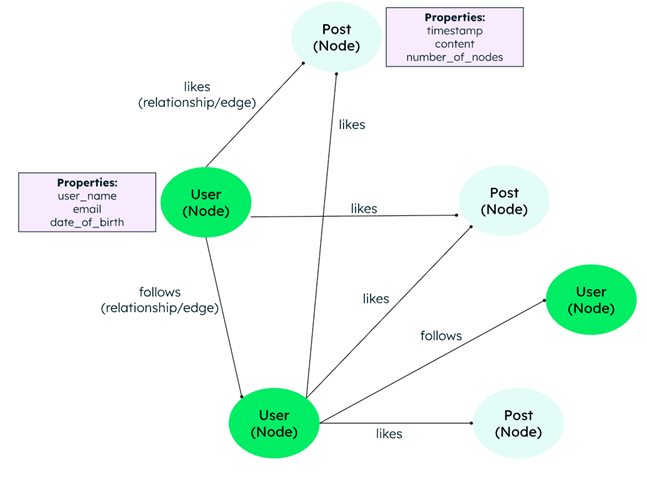

# 1. Introduction

NoSQL (often meaning "not only SQL" or "non-SQL") is a database management approach designed to store and manage data in non-relational formats. Unlike traditional relational systems, NoSQL databases do not require rigid, predefined schemas. They are highly optimized for handling massive volumes of unstructured or semi-structured data.

## Why NoSQL Databases are Used

* **High Performance:** They deliver low latency and rapid data access, which is crucial for modern applications managing large data sets.
* **Scalability:** By leveraging distributed computing and built-in sharding, NoSQL allows applications to scale horizontally across multiple servers.
* **Flexibility:** The dynamic schema allows developers to store diverse data types and modify data structures seamlessly without system-wide downtime.

## The Four Main Types of NoSQL Databases

* **Document Databases (e.g., MongoDB):** Stores data in documents akin to JSON objects, allowing for flexible, nested data models.
    ```text
    {
        "_id": "12345",
        "name": "foo bar",
        "email": "foo@bar.com",
        "address": {
        "street": "123 foo street",
        "city": "some city",
        "state": "some state",
        "zip": "123456"
        },
    "hobbies": ["music", "guitar", "reading"]
    }
    ```
* **Key-Value Databases (e.g., Redis):** Organizes data into a simple dictionary of key-value pairs, which is optimal for caching and fast lookups.
    ```text
        Key: user:12345
        Value: {"name": "foo bar", "email": "foo@bar.com", "designation": "software developer"}
    ```

* **Wide-Column Databases (e.g., Apache Cassandra):** Groups data across a virtually unlimited number of columns rather than rows, supporting heavy data workloads.

    | Name      | ID    | Email        | DOB        | City      |
    |-----------|-------|--------------|------------|-----------|
    | Foo bar   | 12345 | foo@bar.com  |            | Some city |
    | Carn Yale | 34521 | bar@foo.com  | 12-05-1972 |           |

* **Graph Databases (e.g., Neo4j):** Structures data into nodes and explicitly maps the complex relationships between them.

    

---

# 2. How NoSQL Differs from Relational Databases

Relational databases (SQL) and NoSQL databases operate on fundamentally different architectures.

| Feature | Relational Databases (SQL) | NoSQL Databases |
| --- | --- | --- |
| **Data Structure** | Table-based with strict rows and columns. | Non-relational formats like documents, key-value, or graphs. |
| **Schema** | Rigid and fixed; all rows share identical predefined columns. | Dynamic and flexible; structures can change without disrupting existing data. |
| **Scaling** | Vertical scaling; requires adding hardware power (CPU/RAM) to a single server. | Horizontal scaling; distributes processing loads across multiple servers. |
| **Transactions** | Strictly ACID-compliant (Atomicity, Consistency, Isolation, Durability). | Typically BASE-compliant (Basic Availability, Soft state, Eventual consistency). |

---

# 3. Investigation of Five NoSQL Databases

To address the project's current performance limitations, the following NoSQL solutions present distinct advantages:

* **MongoDB (Document):** MongoDB is a document-oriented database utilizing JSON-like documents containing fields and values. It is used extensively for semi-structured data, handling rapid application changes, and scaling across distributed environments.
* **Apache Cassandra (Wide-Column):** A wide-column database that distributes data effectively across numerous columns. It is used when an application requires extremely fast write speeds, high availability, and massive horizontal scaling across servers.
* **Redis (Key-Value):** An open-source, key-value data store that pairs unique keys with respective values. Redis is used for lightning-fast data retrieval, caching frequently accessed information, and managing temporary user sessions.
* **Couchbase (Document):** Similar to MongoDB, Couchbase is a document database designed to store diverse data objects. It is used for its combination of high performance and flexible structure, allowing applications to process unstructured data swiftly.
* **Neo4j (Graph):** A specialized graph database that maps data entities into nodes and explicitly defines their relationships. It is used for applications where understanding the connections between data points is critical, such as recommendation engines and social networks.

---

# 4. Can NoSQL Improve Performance and Scalability?

Yes, adopting a NoSQL database directly addresses performance and scaling bottlenecks.

* **Unrestricted Horizontal Scalability:** Traditional SQL systems eventually reach a physical ceiling because they scale vertically. NoSQL databases bypass this limitation through built-in sharding, meaning capacity grows effectively endlessly by adding new servers to the cluster.
* **Optimized Data Retrieval:** NoSQL architectures eliminate the need for complex, resource-heavy table joins. By storing related data in unified structures (like single documents), they dramatically reduce query response times.
* **Fault Tolerance & Availability:** Adhering to BASE principles, NoSQL architectures ensure high availability. If a single node fails, the distributed system manages temporary inconsistencies and continues processing user requests seamlessly.

---

# 5. Conclusion

While relational databases provide excellent transactional consistency, their rigid schemas and vertical scaling models can severely restrict performance during massive growth phases. By shifting to a NoSQL solution, the project can utilize a flexible schema to handle unstructured data, deploy horizontal scaling to divide workloads effectively, and achieve high-performance data processing. The final selection between systems like MongoDB, Redis, or Cassandra will depend entirely on the specific data models and caching requirements of the application.

---

# 6. References

1. [https://www.youtube.com/watch?v=B3gJT3t8g4Q](https://www.youtube.com/watch?v=B3gJT3t8g4Q)
2. [https://www.ibm.com/think/topics/sql-vs-nosql](https://www.ibm.com/think/topics/sql-vs-nosql)
3. [https://www.mongodb.com/nosql-explained](https://www.mongodb.com/nosql-explained)
4. [https://www.geeksforgeeks.org/introduction-to-nosql/](https://www.geeksforgeeks.org/introduction-to-nosql/)
5. [https://cloud.google.com/discover/what-is-nosql](https://cloud.google.com/discover/what-is-nosql)
